<div align="center">

# Fintrack

**Know where every coin goes.**

A personal & family finance tracker: accounts from your actual banks, two-tap expense entry,
reports that explain themselves, goals with real ETAs, and an AI coach that reads your habits.

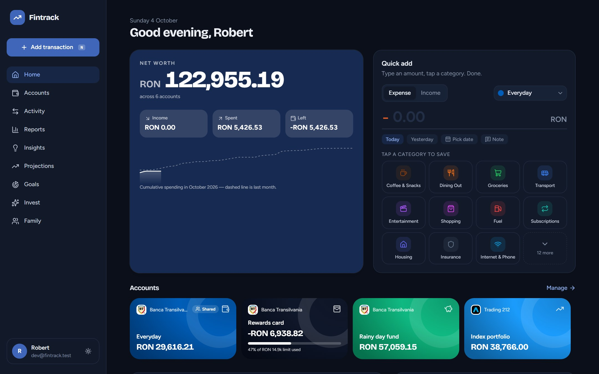

</div>

---

## Highlights

|  |  |
|---|---|
| ⚡ **Two taps to log a purchase** | Type the amount, tap a category — saved. Account and date are pre-filled, the most-used categories float to the top, and <kbd>N</kbd> opens it from anywhere. |
| 🏦 **Your real banks** | Pick a country and choose from its banks, plus global neobanks, brokers and crypto exchanges — 16 countries and 120+ institutions, each with its logo and brand colour. |
| 🎨 **Accounts that feel like yours** | Every account becomes a card: a suggested name ("Robert's ING Card"), brand colour, icon or your own photo, and a credit-limit meter. |
| 📊 **Reports that explain themselves** | Monthly and yearly views with category breakdowns, spending pace vs last month, weekday patterns and like-for-like year-over-year comparisons. |
| 💡 **Insights** | Thirteen kinds of observations — spending faster than last month, categories that jumped, savings-rate swings, streaks, recurring bills, unusual spends, weekend habits, wants vs needs. |
| 🔮 **Projections** | Next months' income and spending from weighted history and trend, recurring payments detected automatically, a realistic end-of-month estimate and a six-month net-worth outlook. |
| 🎯 **Goals with a route** | Save for a car, a house or a PS5: relaxed, balanced, ambitious and on-deadline plans with weekly and monthly amounts, an ETA from your actual saving pace, and a "what if I save X" calculator. |
| 👨‍👩‍👧 **Family budgeting** | Invite your partner with a code, share only the accounts and goals you choose, and see who spent what. |
| ✨ **AI investing coach** | An anonymised summary of your habits goes to Claude, which suggests readiness, a risk profile, an asset-class mix and next steps. Educational, not financial advice. |
| 💱 **Live exchange rates** | Multi-currency accounts (including crypto) roll up into your main currency with daily rates. |

## A closer look

<table>
  <tr>
    <td width="50%">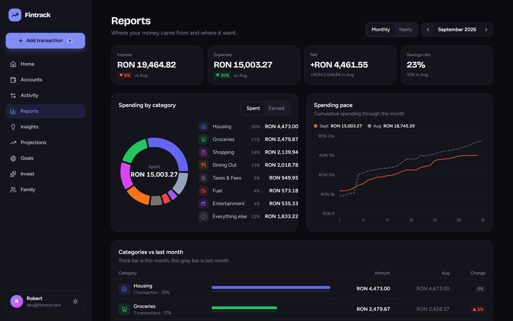<br><sub><b>Monthly report</b> — category donut with a full legend, cumulative spending pace against last month.</sub></td>
    <td width="50%">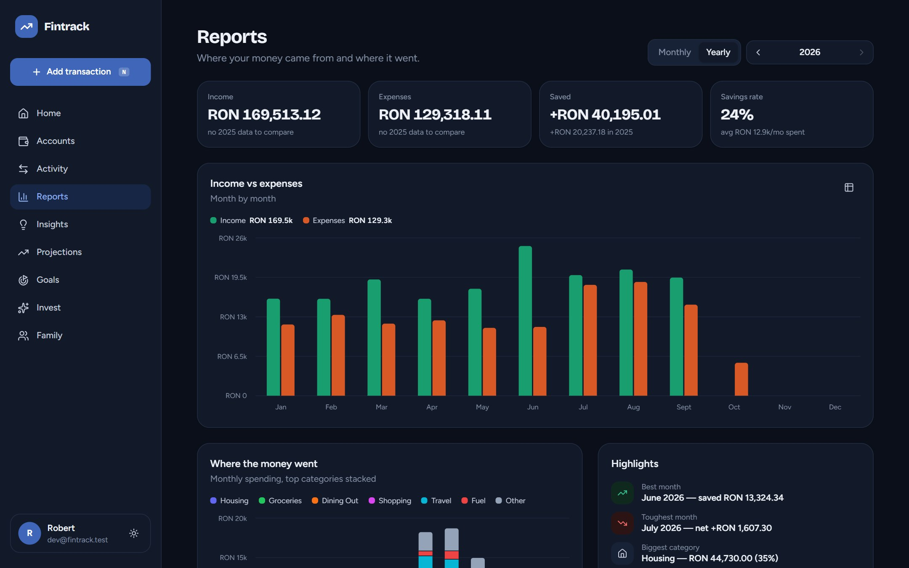<br><sub><b>Yearly report</b> — income vs expenses by month, stacked category spending, best and toughest months.</sub></td>
  </tr>
  <tr>
    <td>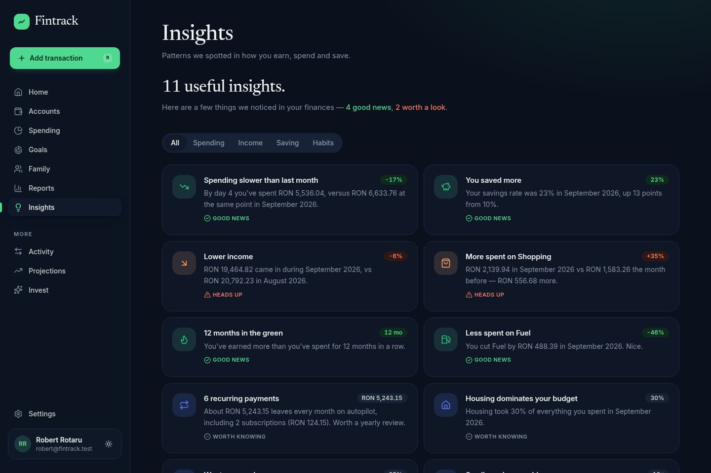<br><sub><b>Insights</b> — good news, heads-ups and habits, grouped and ranked by relevance.</sub></td>
    <td>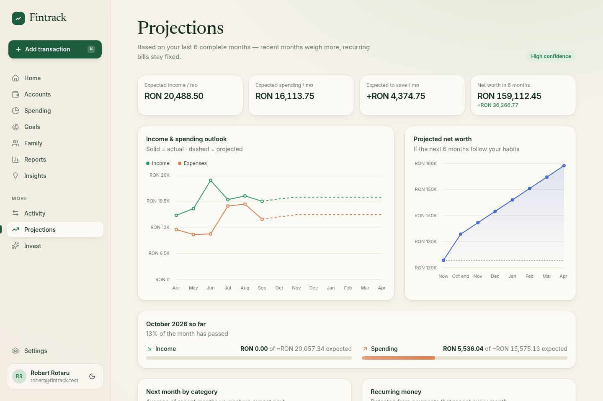<br><sub><b>Projections</b> — actual vs projected cash flow and where your net worth is heading.</sub></td>
  </tr>
  <tr>
    <td>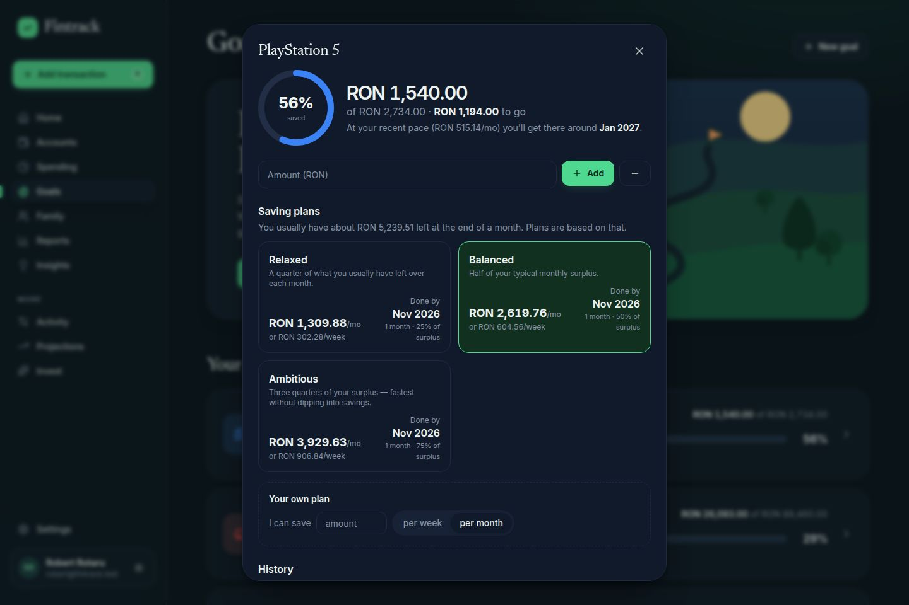<br><sub><b>Goal plans</b> — four ways to get there, each checked against your deadline and your monthly surplus.</sub></td>
    <td>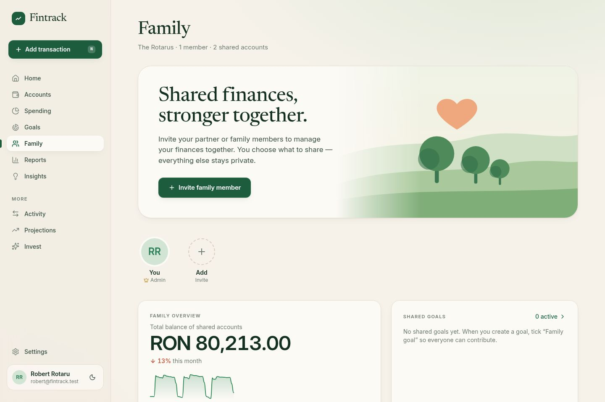<br><sub><b>Family</b> — members, invite code, shared accounts and who spent what this month.</sub></td>
  </tr>
  <tr>
    <td>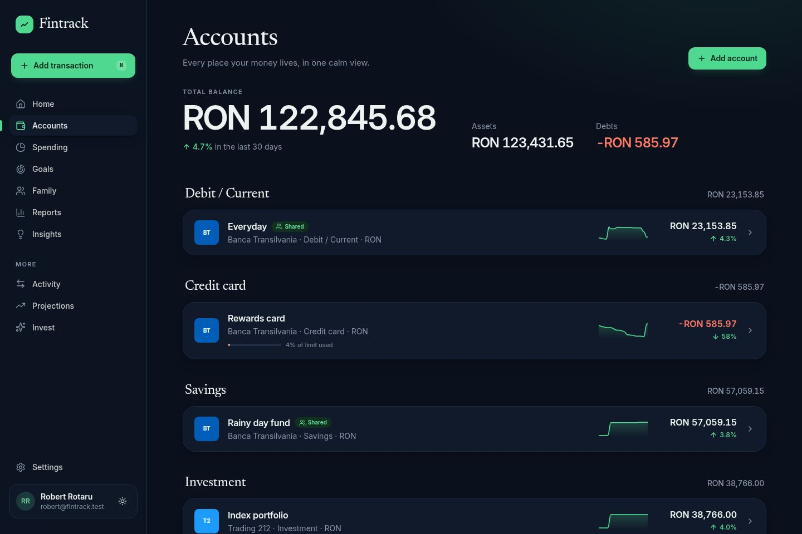<br><sub><b>Accounts</b> — grouped by type, with assets, debts and net worth.</sub></td>
    <td>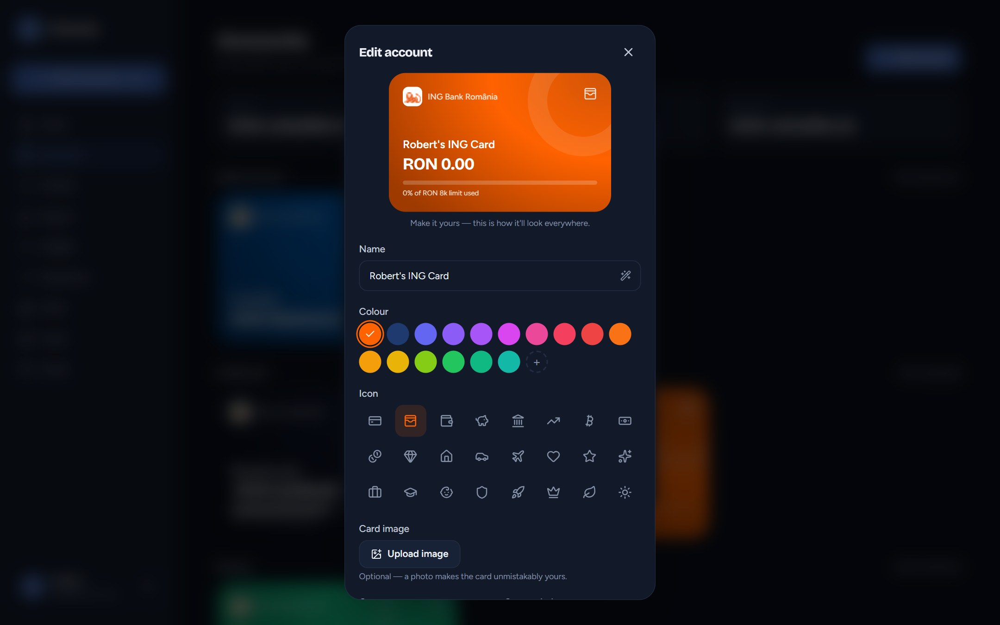<br><sub><b>Personalisation</b> — live card preview, brand colour, icons and custom images.</sub></td>
  </tr>
</table>

### On a phone, and when things aren't perfect

<table>
  <tr>
    <td width="26%" rowspan="2">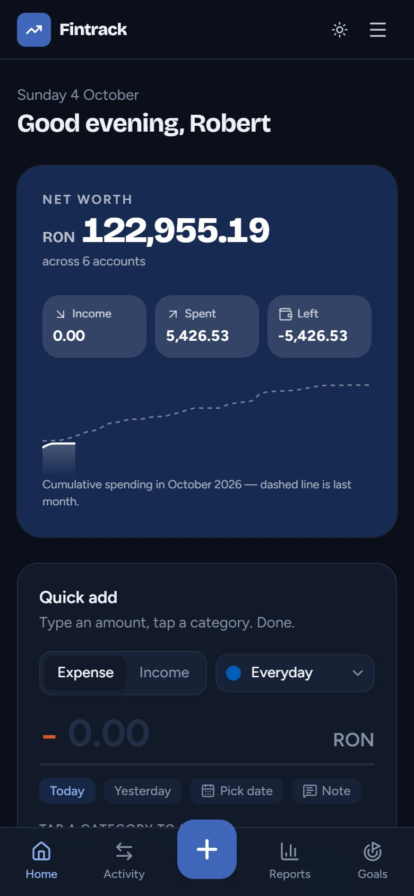<br><sub><b>Phone</b> — bottom navigation with a central add button; the headline figure scales to fit.</sub></td>
    <td width="37%">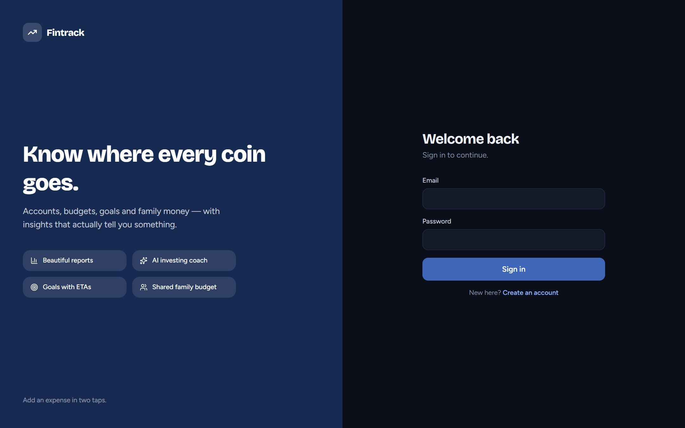<br><sub><b>Sign in</b></sub></td>
    <td width="37%">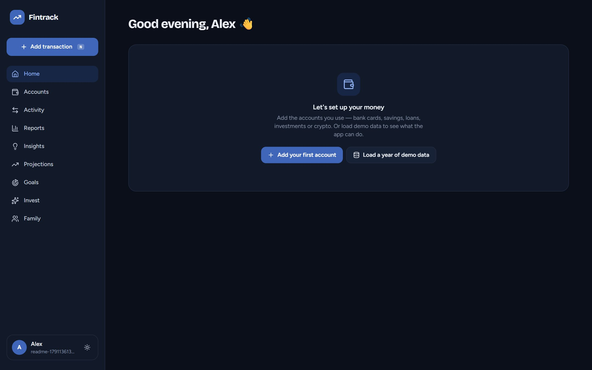<br><sub><b>First run</b> — every page has a helpful empty state; demo data is one click away.</sub></td>
  </tr>
  <tr>
    <td>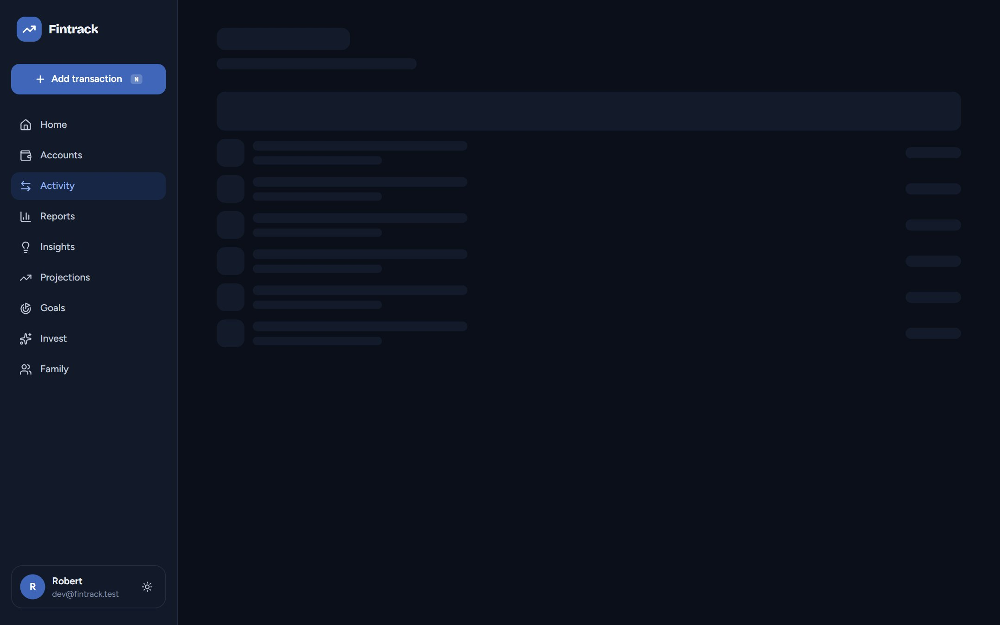<br><sub><b>Loading</b> — page-shaped skeletons, only if loading takes longer than 150ms.</sub></td>
    <td>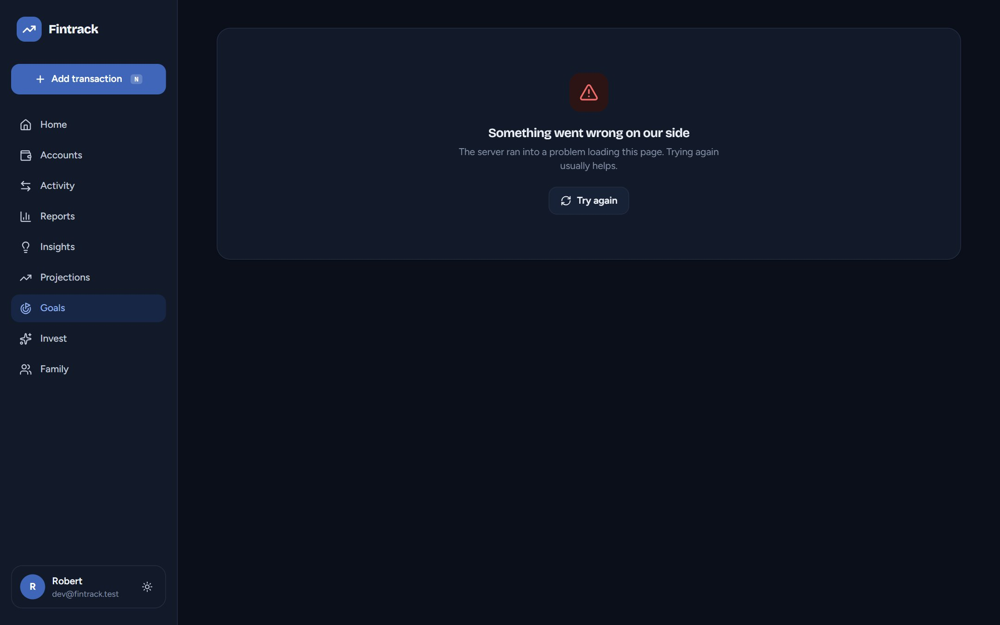<br><sub><b>Errors</b> — a server error never looks like empty data; one tap to retry.</sub></td>
  </tr>
</table>

## How it's built

```
fintrack/
├─ packages/core   Shared, dependency-free TypeScript — the brains.
│                  Reports, insights, projections, goal plans, habit summaries,
│                  default categories, banks by country, currency conversion.
├─ server          REST API — Express 5 + SQLite (node:sqlite), JWT auth,
│                  family sharing, live FX, Claude-powered investing coach.
└─ web             React 19 · Vite · Tailwind CSS 4 · Recharts · TanStack Query.
```

The analytics live in `packages/core` rather than in the UI, so the upcoming mobile app
uses the exact same logic and the same API.

**Tested** with 167 Vitest tests — unit tests for the analytics, API integration tests (validation,
boundary values, permissions, family-sharing isolation) and UI component tests for loading, empty and
error states — plus headless-Chrome end-to-end checks for page transitions, offline behaviour and
failure recovery.

**Design notes**

- **Type:** Bricolage Grotesque for headings and headline figures, Figtree for everything else, with tabular figures wherever amounts line up.
- **Colour:** navy is the one brand colour for primary actions and the headline card, with contrast checked in both themes. Chart series use a colour-blind-safe palette; good/bad states always come with an icon or label, never colour alone.
- **Motion:** a 220ms fade-and-rise between pages, animating only opacity and transform, and switched off for anyone who prefers reduced motion.
- **States:** page-shaped loading skeletons (shown only if loading takes over 150ms), friendly empty states, and distinct error screens for server errors, being offline, a missing page, or a page that failed to download.
- **Responsive:** sidebar on desktop; bottom navigation with a central add button on phones.

**Data & privacy**

- Family members only see what is explicitly shared, and only the person who added a transaction can edit or delete it.
- The AI coach receives aggregates only — averages, category shares and balance totals. No names, notes or bank details.
- Exchange rates come from [ExchangeRate-API](https://www.exchangerate-api.com) (fiat, daily) and Coinbase (crypto), cached server-side with an offline fallback.

## Default categories

Built from the categories that recur across common budgeting frameworks (50/30/20, envelope budgeting) — fixed needs first, then variable needs, wants and obligations. All of them can be renamed, recoloured or archived, and users can add their own.

- **Expenses:** Housing · Utilities · Internet & Phone · Insurance · Groceries · Transport · Fuel · Health · Kids · Pets · Education · Dining Out · Coffee & Snacks · Shopping · Entertainment · Subscriptions · Travel · Personal Care · Sports & Fitness · Gifts & Donations · Debt Payments · Taxes & Fees · Other
- **Income:** Salary · Bonus · Freelance · Business · Investments · Interest · Rental · Benefits · Gifts · Refunds · Other

## API at a glance

All routes live under `/api` and speak JSON; everything except auth and FX needs a bearer token.

| Area | Endpoints |
|---|---|
| Auth & profile | `POST /auth/register` · `POST /auth/login` · `GET/PATCH /auth/me` |
| Money | `/accounts` · `/categories` · `/transactions` · `/transfers` (CRUD) |
| Goals | `/goals` (CRUD) · `POST /goals/:id/contributions` |
| Family | `GET/POST/PATCH /household` · `POST /household/join` · `/leave` · `/invite-code` · `DELETE /household/members/:id` |
| Intelligence | `GET/POST /ai/investment` · `GET /fx` |

## Roadmap

- [ ] Mobile app (Expo / React Native) on the same API and `@ft/core`
- [ ] Per-category monthly budgets with alerts
- [ ] Bank sync via open banking (PSD2)
- [ ] AI buying suggestions once a goal is reached
- [ ] Push notifications for insights and goal milestones
